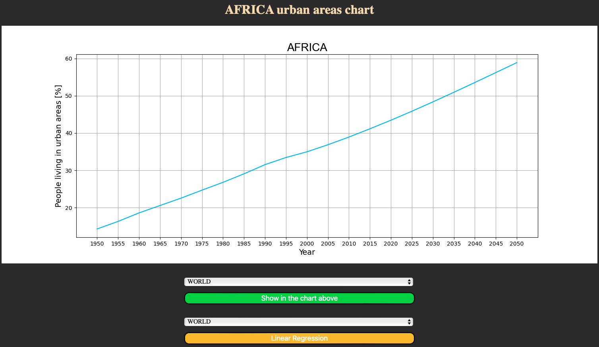
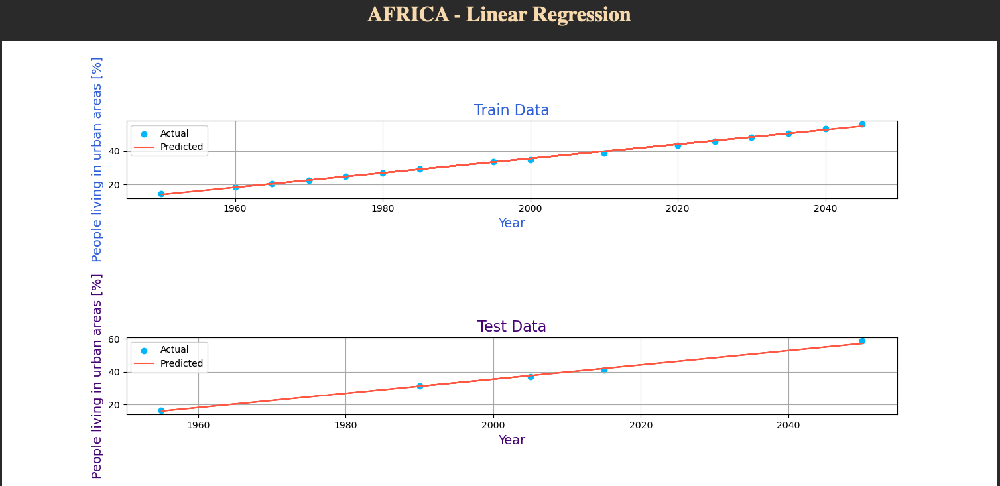
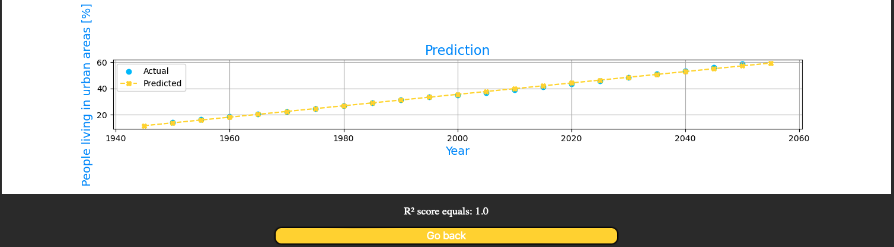

# Matplotlib in flask

Simple flask app using basic python analitics tools such as: pandas, matplotlib, sqlite3.

This app loads data from excel file, create local database, show data from DB in the matplotlib chart and calculate Linear Regression.

---

## Screenshots

 
<h4>Linear Regression</h3>

